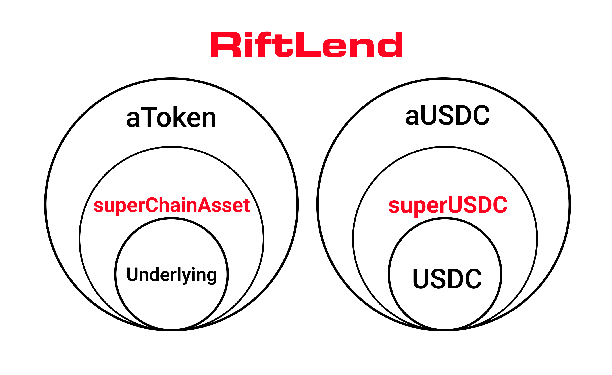

# SuperChainAssets

## Token Architecture: Underlying Assets, aTokens, and SuperChainAssets.&#x20;

In Trad-DeFi, when users supply assets like USDC to the protocol, these supplied assets are called "underlying assets". In return for supplying these assets, users receive "aTokens" which represent their deposit.&#x20;

aTokens follow a simple naming convention - the letter "a" followed by the asset name (e.g. aUSDC for USDC deposits, aSTK for STK deposits).

<figure><figcaption></figcaption></figure>

RiftLend introduces a new paradigm across the Superchain called "SuperChainAssets". These are wrapper tokens that provide a seamless cross-chain experience for users.&#x20;

When users deposit an underlying asset like USDC, they first receive a SuperChainAsset (e.g. superUSDC). This SuperChainAsset then acts as the underlying asset for minting aTokens.

<figure><figcaption></figcaption></figure>

The relationship between these tokens is:

1. User deposits underlying asset (e.g. USDC).
2. Protocol mints SuperChainAsset (e.g. superUSDC).
3. SuperChainAsset is used to mint aTokens (e.g. aUSDC).

This architecture enables efficient cross-chain operations while maintaining compatibility with Aave's battle-tested DeFi Lending token model.

**How it works:**

1. Lenders deposit underlying assets (e.g., 100 USDC) into RiftLend.
2. The Protocol mints an equivalent amount of SuperChainAssets (e.g., 100 superUSDC).
3. SuperChainAssets are further used to mint aTokens (e.g., aUSDC), which accrue interest.
4. Interest is distributed periodically based on utilization of the lending pool.
